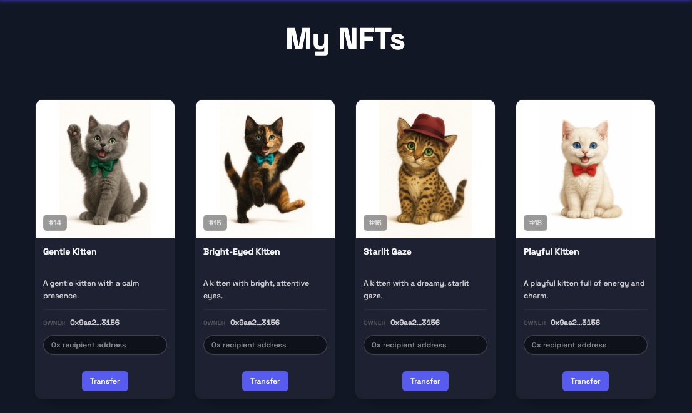
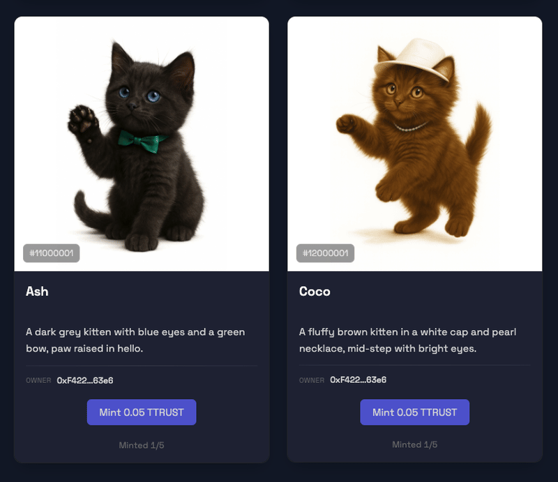

<h1 align="center">Kitten NFT Gallery</h1>
<p align="center">
  <a href="https://meow.intuition.box/"></a>
  <a href="https://github.com/ChainsQueenEth/web3dashboard/actions/workflows/ci.yml"></a>
  =20.18.3" />
  
</p>


<p align="center">
  <a href="#features">Features</a> ·
  <a href="#ui-showcase">UI Screenshots</a> ·
  <a href="#quick-start">Quick Start (Yarn)</a> ·
  <a href="#kittenssol">Kittens.sol</a> ·
  <a href="#structure">Structure</a> ·
  <a href="#license">License</a>
</p>


<h2 id="features" align="center">Features</h2>

- Modern ERC‑721 dApp: Hardhat (contracts) + Next.js (UI)
- Aggregated “My NFTs” across mapped ERC‑721 contracts on the active chain
- IPFS metadata with gateway fallbacks
- Wallet connect and on‑chain reads via wagmi/viem
- Fast local dev (yarn chain · yarn deploy · yarn start)


 <h2 align="center">UI Showcase</h2>
<p align="center" style="margin: 28px 0 36px;">
  <span style="display:inline-block; width:49%; text-align:center; vertical-align:top;">
    
    <br />
    <sub>Welcome screen with wallet connect, featured kittens, and quick links to Gallery and My NFTs.</sub>
  </span>
</p>


<p align="center" style="margin: 28px 0 36px;">
  <span style="display:inline-block; width:49%; text-align:center; vertical-align:top;">
    
    <br />
    <sub>Gallery page with all kittens displayed in a grid layout.</sub>
  </span>
</p>


<p align="center" style="margin: 28px 0 36px;">
  <span style="display:inline-block; width:49%; text-align:center; vertical-align:top;">
    
    <br />
    <sub>My NFTs page with a list of all kittens owned by the user.</sub>
  </span>
</p>


<h3 align="center">NFT Collection Preview</h3>
<p align="center" style="max-width: 720px; margin: 0 auto;">
  
  <br />
  <sub>Animated preview of the kitten collection.</sub>
</p>


<h2 align="center">Tech Stack (short)</h2>

Solidity + Hardhat (OpenZeppelin ERC‑721), Next.js (React/Tailwind/DaisyUI), wagmi/viem, TypeScript, ESLint/Prettier. Optional IPFS static export.

<h2 id="structure" align="center">Structure (brief)</h2>

- `packages/hardhat/` – Solidity contracts, deploy scripts, deployments
- `packages/nextjs/` – Next.js app (app/, partials/, utils/, contracts/)

<h2 id="quick-start" align="center">Quick Start (Yarn)</h2>

1) Requirements
   - Node >= 20.18.3
   - Yarn 3.x (see `"packageManager": "yarn@3.2.3"`)

2) Install

```bash
yarn install
```

  
<h3 align="center">Environment Variables</h3>

| App | File | Variable | Purpose |
|---|---|---|---|
| Hardhat | `packages/hardhat/.env` | `ALCHEMY_API_KEY` | RPC provider for deployments/tests |
| Hardhat | `packages/hardhat/.env` | `ETHERSCAN_V2_API_KEY` | Contract verification |
| Hardhat | `packages/hardhat/.env` | `DEPLOYER_PRIVATE_KEY` | Deployer account (keep secret) |
| Next.js | `packages/nextjs/.env` | `NEXT_PUBLIC_*` | Public UI config (chain id, RPC, flags) |

> Security: Never commit `.env` files or private keys. Use a separate deployer account with minimal funds for testnets.

<h4>Contracts quick commands</h4>

- __Compile contracts__

  ```bash
  yarn hardhat:compile
  ```

  Compiles Solidity sources in `packages/hardhat/contracts/` and generates artifacts + typechain types. Run this after changing contracts or on a fresh checkout.

- __Deploy to Intuition testnet__

  ```bash
  yarn hardhat:deploy --network intuition
  ```

  Uses `hardhat-deploy` to execute scripts in `packages/hardhat/deploy/` against the `intuition` network.

  Requirements:
  - `packages/hardhat/.env`: set `DEPLOYER_PRIVATE_KEY` (funded test account)
  - `ALCHEMY_API_KEY` or an RPC URL configured for `intuition` in `hardhat.config.ts`

  Output:
  - Writes ABIs and addresses to `packages/hardhat/deployments/`
  - The Next.js app reads these to interact with the deployed contracts

3) Run locally

```bash
# Terminal 1
yarn chain

# Terminal 2
yarn compile && yarn deploy

# Terminal 3
yarn start
# Open http://localhost:3000
```
<h2 align="center">Usage & Deployment</h2>

<h3 align="center">Common Commands</h3>
<details>
<summary><b>Show commands</b></summary>

- __Contracts__
  - `yarn compile` – Compile contracts
  - `yarn test` – Run tests on Hardhat network
  - `yarn deploy` – Deploy using `hardhat-deploy` (uses deployer key)
  - `yarn verify` – Verify on Etherscan (set `ETHERSCAN_V2_API_KEY`)
  - `yarn hardhat:flatten` – Flatten contracts
  - Accounts utils:
    - `yarn account` – List account(s)
    - `yarn account:generate` – Generate deployer
    - `yarn account:import` – Import private key
    - `yarn account:reveal-pk` – Reveal stored PK

- __Frontend__
  - `yarn start` – Next.js dev
  - `yarn next:build` / `yarn next:serve` – Build/serve
  - `yarn ipfs` – Static export + upload to IPFS via bgipfs

- __Quality__
  - `yarn lint` – Lint (frontend + contracts)
  - `yarn format` – Prettier format

</details>

<h2 id="kittenssol" align="center">Kittens.sol (focus)</h2>

File: `packages/hardhat/contracts/Kittens.sol`
- ERC‑721 Enumerable + URI Storage + Ownable
- Key funcs: `mintItem(address to, string uri)`, `mintBatch(address to, string[] uris)`, transfers via standard `safeTransferFrom/transferFrom`
- Constants: `MAX_SUPPLY = 12`, `MINT_PRICE = 0.05 ether`
- Emits: `Minted(tokenId, to, uri)`

Mint examples (Hardhat console):
```js
const c = await ethers.getContractAt("Kittens", (await deployments.get("Kittens")).address);
await c.mintItem("0xYOUR_ADDRESS", "ipfs://<CID>/image-kitten-01.json", { value: ethers.parseEther("0.05") });
await c.mintBatch("0xYOUR_ADDRESS", ["ipfs://<CID>/image-kitten-01.json", "ipfs://<CID>/image-kitten-02.json"]);
```

<h3 align="center">Kittens Auto‑Mint Recap</h3>

**Prepared auto‑mint env** in `packages/hardhat/.env`:

```
MINT_AFTER_DEPLOY=true
MINT_URIS=["ipfs://.../image-kitten-01.json","ipfs://.../image-kitten-02.json", ..., "ipfs://.../image-kitten-12.json"]
```

**Ran the Kittens deploy script** from repo root:

```
yarn workspace @se-2/hardhat deploy --network intuition --tags Kittens
```

The script `packages/hardhat/deploy/02_deploy_kittens.ts` reused the existing deployment at
`0x20b691728B6fdaB7Ae0cBe7C73E170ed41e5A32d`, connected as the owner
(`0xF4220e5c9882746f4F52FC61Dcfd1095c5D563e6`), and called `mintBatch(...)`.

**Mint succeeded**
- Log: `Minted 12 token(s). Tx: 0xb7e19334c1a09f4cda2be096bcf87a90be01b28473229c7907a47802964ab292`

**Verify (optional)**
- Path: `packages/hardhat/`
- Console: `yarn hardhat console --network intuition`

```js
const c = await ethers.getContractAt("Kittens","0x20b691728B6fdaB7Ae0cBe7C73E170ed41e5A32d");
(await c.totalSupply()).toString(); // expect "12"
await c.tokenURI(1);
```

**Avoid duplicate auto‑mints**
- In `packages/hardhat/.env`, set `MINT_AFTER_DEPLOY=false` once done (keep `MINT_URIS` for reference).
