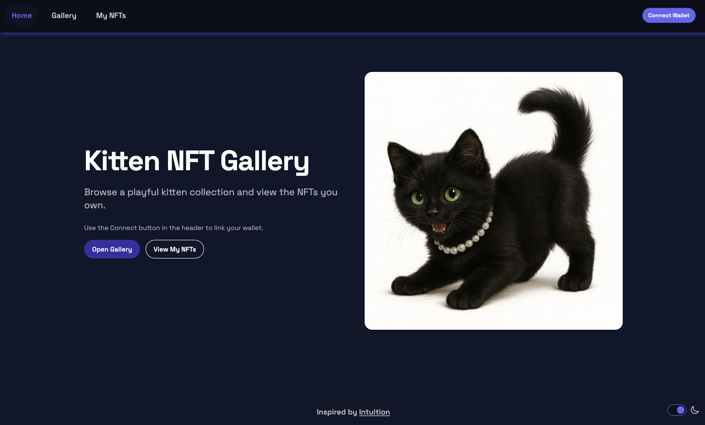
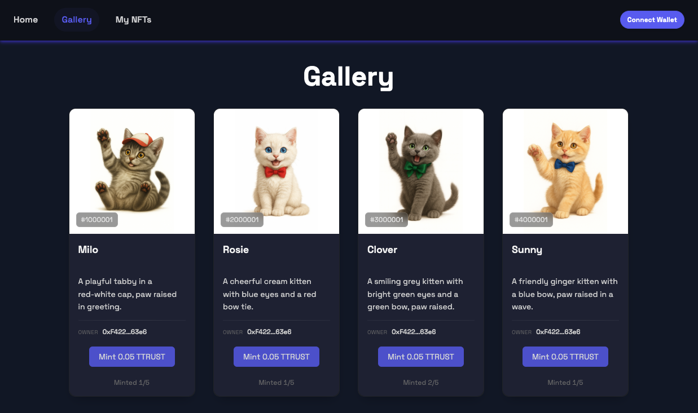

<h1 align="center">Kitten NFT Gallery</h1>
<p align="center">
  <a href="https://meow.intuition.box/"></a>
  <a href="https://github.com/ChainsQueenEth/web3dashboard/actions/workflows/ci.yml"></a>
  =20.18.3" />
  
</p>


<p align="center">
  <a href="#start-here">🚀 Start here</a> ·
  <a href="#features">✨ Features</a> ·
  <a href="#env">🔧 Environment</a> ·
  <a href="#ui-showcase">🖥️ User Interface</a> ·
  <a href="#tech-stack">🧰 Tech Stack</a> ·
  <a href="#structure">📂 Structure</a> ·
  <a href="#quick-start">⚡ Quick Start</a> ·
  <a href="#usage">📦 Usage & Deployment</a> ·
  <a href="#troubleshooting">🛠️ Troubleshooting</a> ·
  <a href="#contract">📜 Contract</a> ·
  <a href="#glossary">📖 Glossary</a>
</p>


<h2 id="start-here" align="center">🚀 New here? Start here (2 minutes)</h2>

1. [CWD](#glossary-cwd): `/`
   - `yarn install`
   - `yarn chain`
   - `yarn compile && yarn deploy --network hardhat`
   - `yarn start` → open http://localhost:3000
2. To deploy on Intuition later: `yarn deploy --network intuition`
3. Environment file for contracts: `packages/hardhat/.env`
   - `ALCHEMY_API_KEY`,
   - `__RUNTIME_DEPLOYER_PRIVATE_KEY`,
   - `ETHERSCAN_V2_API_KEY` (optional).


<h2 id="features" align="center">✨ Features</h2>

- Modern [ERC‑721](#glossary-erc-721) dApp: Hardhat (contracts) + Next.js (UI)
- Aggregated “My [NFTs](#glossary-nft)” across mapped [ERC‑721](#glossary-erc-721) contracts on the active chain
- [IPFS](#glossary-ipfs) metadata with gateway fallbacks
- Wallet connect and on‑chain reads via wagmi/viem
- Fast local dev (yarn chain · yarn deploy · yarn start)


<h2 id="env" align="center">🔧 Environment Variables</h2>

| App | File | Keys | Purpose |
| --- | --- | --- | --- |
| Hardhat | `packages/hardhat/.env` | `__RUNTIME_DEPLOYER_PRIVATE_KEY` | Deployer account used for `yarn deploy` |
| Hardhat | `packages/hardhat/.env` | `ALCHEMY_API_KEY` (or full RPC URL) | RPC provider for deployments/tests |
| Hardhat | `packages/hardhat/.env` | `ETHERSCAN_V2_API_KEY` (optional) | Contract verification (if supported) |
| Next.js | `packages/nextjs/.env` | `NEXT_PUBLIC_*` | Public UI config (chain id, RPC, flags) |

Note: Never commit `.env` files. Use separate, low‑funded accounts for testnets.


 <h2 id="ui-showcase" align="center">🖥️ User Interface</h2>
<p align="center" style="margin: 28px 0 36px;">
  <span style="display:inline-block; width:49%; text-align:center; vertical-align:top;">
    
    <br />
    <sub>Welcome screen with wallet connect, a featured kitten, and quick links to Gallery and My NFTs.</sub>
  </span>
</p>


<p align="center" style="margin: 28px 0 36px;">
  <span style="display:inline-block; width:49%; text-align:center; vertical-align:top;">
    
    <br />
    <sub>Gallery page with all kittens displayed in a grid layout.</sub>
  </span>
</p>


<h2 id="tech-stack" align="center">🧰 Tech Stack (short)</h2>

- Solidity + Hardhat (OpenZeppelin ERC‑721)
- Next.js (React, Tailwind, DaisyUI)
- wagmi/viem
- TypeScript
- ESLint/Prettier
- Optional: IPFS static export

<h2 id="structure" align="center">📂 Structure (brief)</h2>

- `packages/hardhat/` – Solidity contracts, deploy scripts, deployments
- `packages/nextjs/` – Next.js app (app/, partials/, utils/, contracts/)


<h2 align="center">🔧 Environment Variables</h2>


| App | File | Variable | Purpose |
|---|---|---|---|
| Hardhat | `packages/hardhat/.env` | `ALCHEMY_API_KEY` | RPC provider for deployments/tests |
| Hardhat | `packages/hardhat/.env` | `ETHERSCAN_V2_API_KEY` | Contract verification |
| Hardhat | `packages/hardhat/.env` | `__RUNTIME_DEPLOYER_PRIVATE_KEY` | Deployer account (keep secret) |
| Next.js | `packages/nextjs/.env` | `NEXT_PUBLIC_*` | Public UI config (chain id, RPC, flags) |

> Security: Never commit `.env` files or private keys. Use a separate deployer account with minimal funds for testnets.


<h2 id="quick-start" align="center">⚡ Quick Start (Yarn)</h2>

1) Requirements
   - Node >= 20.18.3
   - Yarn 3.x (see `"packageManager": "yarn@3.2.3"`)

2) Install

```bash
yarn install
```
3) Run locally

```bash
# Terminal 1
yarn chain

# Terminal 2
yarn compile && yarn deploy

# Terminal 3
yarn start
# Open http://localhost:3000
```

<h2 id="usage" align="center">📦 Usage & Deployment</h2>

<a id="glossary-cwd"></a>
<h3 align="center">Commands</h3>

<h4 align="center">⚙️ Contracts</h4>

<h5 align="center">Contract Setup & Build</h5>

| CWD | Command | Description |
| --- | --- | --- |
| / | `yarn install` | Installs all workspace dependencies. |
| / | `yarn compile` | Compiles Solidity, generates artifacts and TypeChain types. |
| / | `yarn test` | Runs Hardhat tests on the in‑memory Hardhat network. |
| / | `yarn hardhat:flatten` | Creates a single Solidity file by merging a contract and its imports. |

<h5 align="center">Deploy & Verify</h5>

| CWD | Command | Description |
| --- | --- | --- |
| / | `yarn deploy --network intuition` | Deploys contracts to Intuition (via hardhat‑deploy) and generates TS ABIs. |
| / | `yarn verify --network intuition` | Verifies contracts from deployments on the Intuition explorer (if supported). |

<h3 align="center">Accounts & Keys</h3>

| CWD | Command | Description |
| --- | --- | --- |
| / | `yarn account` | Lists the encrypted deployer account and balances across configured networks. |
| / | `yarn account:generate` | Generates a new deployer, encrypts it, and stores `DEPLOYER_PRIVATE_KEY_ENCRYPTED` in `packages/hardhat/.env`. |
| / | `yarn account:import` | Imports your deployer private key into `packages/hardhat/.env` (required to deploy to Intuition). |
| / | `yarn account:reveal-pk` | Reveals the decrypted private key from `DEPLOYER_PRIVATE_KEY_ENCRYPTED` (use with caution). |


<h5 align="center">Network & Console</h5>

| CWD | Command | Description |
| --- | --- | --- |
| / | `yarn chain` | Starts a local Hardhat [JSON‑RPC](#glossary-json-rpc) node. |
| / | `yarn workspace @se-2/hardhat hardhat console --network intuition` | Interactive console to read/write contract state on Intuition. |
| / | `yarn workspace @se-2/hardhat hardhat run scripts/debug-tokenuri.ts --network intuition` | Runs a script against Intuition. |

<a id="glossary-rpc"></a><a id="glossary-json-rpc"></a>

<h4 align="center">🖥️ Frontend</h4>

| CWD | Command | Description |
| --- | --- | --- |
| / | `yarn start` | Starts the Next.js dev server at `http://localhost:3000`. |
| / | `yarn next:build` | Builds the Next.js app for production. |
| / | `yarn next:serve` | Serves the production build locally. |
| / | `yarn ipfs` | Static export and upload to [IPFS](#glossary-ipfs) via bgipfs. |

<h4 align="center">✅ Quality</h4>

| CWD | Command | Description |
| --- | --- | --- |
| / | `yarn lint` | Runs ESLint across frontend and contracts. |
| / | `yarn format` | Formats code with Prettier. |

<h2 id="troubleshooting" align="center">🛠️ Troubleshooting</h2>

<h3 align="center">🔑 Environment</h3>

| Issue | Fix |
| --- | --- |
| Environment not set | Set `__RUNTIME_DEPLOYER_PRIVATE_KEY`. Optional: `ALCHEMY_API_KEY` (not needed for Intuition), `ETHERSCAN_V2_API_KEY` (if explorer supports API verification). |
| Deploy cannot sign | Ensure `__RUNTIME_DEPLOYER_PRIVATE_KEY` is set; then `yarn deploy --network intuition`. |

<h3 align="center">🚀 Deploy & Verify</h3>

| Issue | Fix |
| --- | --- |
| Intuition verification | If `yarn verify --network intuition` fails, use: `yarn workspace @se-2/hardhat hardhat verify --network intuition <address> [args...]`. |

<h3 align="center">🖼️ Metadata</h3>

| Issue | Fix |
| --- | --- |
| Metadata not showing | Run: `CONTRACT_ADDRESS=0x089... TOKEN_ID=1 FETCH=1 yarn workspace @se-2/hardhat hardhat run --network intuition scripts/debug-tokenuri.ts`. |

<h3 align="center">🛠️ Local Dev</h3>

| Issue | Fix |
| --- | --- |
| [CWD](#glossary-cwd) basics | Repo root: `/NFTs`; Hardhat: `/packages/hardhat`; Next.js: `/packages/nextjs`. |
| Port in use / local node issues | Stop any running nodes or change ports; retry `yarn chain`. |
| Stale artifacts or types | `yarn workspace @se-2/hardhat hardhat clean && yarn compile`. |
| Frontend not picking up new contracts | Re-deploy or re-run compile to regenerate TS ABIs. |


<h3 align="center">Quick on-chain verification (KittensV2)</h3>

```js
// Open console on Intuition (chainId 13579)
// yarn workspace @se-2/hardhat hardhat console --network intuition

const addr = "0x136b70baaDA29Dd86190F85F45281b0C0d1bdeDC";
const c = await ethers.getContractAt("KittensV2", addr);

(await c.defaultMaxPerKitten()).toString(); // expect "5"
await c.saleActive();                        // expect true
(await c.totalSupply()).toString();          // minted count (e.g., "0" initially)

(await c.mintedPerKitten(1)).toString();    // minted for kittenId=1
(await c.maxPerKitten(1)).toString();       // 0 ⇒ uses defaultMaxPerKitten
```

<a id="glossary-uri"></a><a id="glossary-tokenuri"></a><a id="glossary-erc-721"></a><a id="glossary-nft"></a>
<h2 id="contract" align="center">📜 Contract (overview)</h2>

File: `packages/hardhat/contracts/Kittens.sol`
- Constructor: expects an `owner` address (read from `OWNER_ADDRESS` in `.env`), otherwise defaults to the `deployer` named account.
- [ERC‑721](#glossary-erc-721) Enumerable + [URI](#glossary-uri) Storage + Ownable
- Key funcs: `mintItem(address to, string uri)`, `mintBatch(address to, string[] uris)`, transfers via standard `safeTransferFrom/transferFrom`
- Constants: `MAX_SUPPLY = 12`, `MINT_PRICE = 0.05 ether`
- Emits: `Minted(tokenId, to, uri)`

Mint examples (Hardhat console):
```js
const c = await ethers.getContractAt("Kittens", (await deployments.get("Kittens")).address);
await c.mintItem("0xYOUR_ADDRESS", "ipfs://<CID>/image-kitten-01.json", { value: ethers.parseEther("0.05") });
await c.mintBatch("0xYOUR_ADDRESS", ["ipfs://<CID>/image-kitten-01.json", "ipfs://<CID>/image-kitten-02.json"]);
```

<a id="glossary-ipfs"></a><a id="glossary-cid"></a>
<h3 align="center">Kittens Auto‑Mint Recap</h3>

**Prepared auto‑mint env** in `packages/hardhat/.env`:

```
MINT_AFTER_DEPLOY=true
MINT_URIS=["ipfs://.../image-kitten-01.json","ipfs://.../image-kitten-02.json", ..., "ipfs://.../image-kitten-12.json"]
```

**Ran the Kittens deploy script** from repo root:

```
yarn workspace @se-2/hardhat deploy --network intuition --tags Kittens
```

The script `packages/hardhat/deploy/02_deploy_kittens.ts` reused the existing deployment at
`0x20b691728B6fdaB7Ae0cBe7C73E170ed41e5A32d`, connected as the owner
(`0xF4220e5c9882746f4F52FC61Dcfd1095c5D563e6`), and called `mintBatch(...)`.

**Mint succeeded**
- Log: `Minted 12 token(s). Tx: 0xb7e19334c1a09f4cda2be096bcf87a90be01b28473229c7907a47802964ab292`

**Verify (optional)**
- Path: `packages/hardhat/`
- Console: `yarn hardhat console --network intuition`

```js
const c = await ethers.getContractAt("Kittens","0x20b691728B6fdaB7Ae0cBe7C73E170ed41e5A32d");
(await c.totalSupply()).toString(); // expect "12"
await c.tokenURI(1);
```

**Avoid duplicate auto‑mints**
- In `packages/hardhat/.env`, set `MINT_AFTER_DEPLOY=false` once done (keep `MINT_URIS` for reference).

<h3 align="center">About the deploy script: 02_deploy_kittens.ts</h3>

| Field | Details |
| --- | --- |
| Path | `packages/hardhat/deploy/02_deploy_kittens.ts` |
| What it is | `hardhat-deploy` script for `Kittens.sol`. Scripts in `deploy/` run automatically on `yarn deploy`. |
| How it runs | CWD `/`: `yarn deploy --network <network>` • CWD `packages/hardhat/`: `yarn hardhat deploy --network <network>` |
| Inputs | `namedAccounts.deployer` (from `packages/hardhat/hardhat.config.ts`); `.env`: `__RUNTIME_DEPLOYER_PRIVATE_KEY`; Optional: `OWNER_ADDRESS`, `MINT_AFTER_DEPLOY`, `MINT_URIS`, `MINT_KITTEN_IDS` |
| Outputs | Writes `packages/hardhat/deployments/<network>/Kittens.json` (address + ABI); triggers TS ABI generation read by the frontend |
| Tips | Idempotent re‑runs; for upgrades, add a new script (e.g., `03_deploy_kittens_v2.ts`); target with `--tags Kittens` |

<a id="glossary-dotenv"></a>
<h3 align="center">About Hardhat config: hardhat.config.ts</h3>

| Field | Details |
| --- | --- |
| Path | `packages/hardhat/hardhat.config.ts` |
| What it is | Central config for Solidity, networks (e.g., `intuition`), plugins, verification, named accounts. |
| Key responsibilities | Defines `solidity` compiler/optimizer; declares networks (RPC + key); configures verification and `hardhat-deploy`; sets `namedAccounts.deployer`; extends `deploy` to generate TS ABIs. |
| How pieces connect | `.env` → `hardhat.config.ts` → `yarn deploy --network intuition` uses account + RPC → `02_deploy_kittens.ts` deploys → `deployments/<network>` written → extended task generates ABIs → Next.js reads addresses/ABIs. |
| Useful commands | `/`: `yarn deploy --network intuition` • `/`: `yarn verify --network intuition` • `/`: `yarn workspace @se-2/hardhat hardhat console --network intuition` |

<a id="glossary-abi"></a><a id="glossary-ts-abi"></a>
<h3 align="center">Where ABIs and addresses live</h3>

| Field | Details |
| --- | --- |
| Deployments | `packages/hardhat/deployments/<network>/Kittens.json` (address + ABI written by hardhat-deploy) |
| Frontend artifacts | Check imports in `packages/nextjs/` and shared artifacts in `packages/nextjs/contracts/` |
| Refresh if out of sync | Run `yarn compile` or `yarn deploy --network <network>` |

Reference: hardhat-deploy docs — https://github.com/wighawag/hardhat-deploy

<h2 id="glossary" align="center">📖 Glossary</h2>

| Short | Full name | Simple explanation |
| --- | --- | --- |
| [RPC](#glossary-rpc) | Remote Procedure Call | The endpoint through which an app communicates with a blockchain node. |
| [JSON‑RPC](#glossary-json-rpc) | JSON Remote Procedure Call | Standard request/response protocol (HTTP/WebSocket) used by Ethereum nodes. |
| [ABI](#glossary-abi) | Application Binary Interface | Descriptions of contract methods and events; enables encoding/decoding calls. |
| [TS ABI](#glossary-ts-abi) | TypeScript ABI types | Generated TypeScript types from the ABI to type contract calls. |
| [ERC‑721](#glossary-erc-721) | Ethereum NFT standard 721 | Standard for unique (non‑fungible) tokens, e.g., NFTs. |
| [IPFS](#glossary-ipfs) | InterPlanetary File System | Decentralized storage for NFT metadata and images. |
| [CID](#glossary-cid) | Content Identifier | Hash‑like identifier that points to content on the IPFS network. |
| [CWD](#glossary-cwd) | Current Working Directory | The folder you execute a command from. |
| [.env](#glossary-dotenv) | Environment variables file | Local file storing secrets and configuration (not committed to git). |
| [URI](#glossary-uri) | Uniform Resource Identifier | Generic resource address, e.g., `ipfs://...`. |
| [TokenURI](#glossary-tokenuri) | Token metadata URI | Address where NFT metadata is stored (often `ipfs://...`). |
| [NFT](#glossary-nft) | Non‑Fungible Token | Unique digital asset on the blockchain. |
